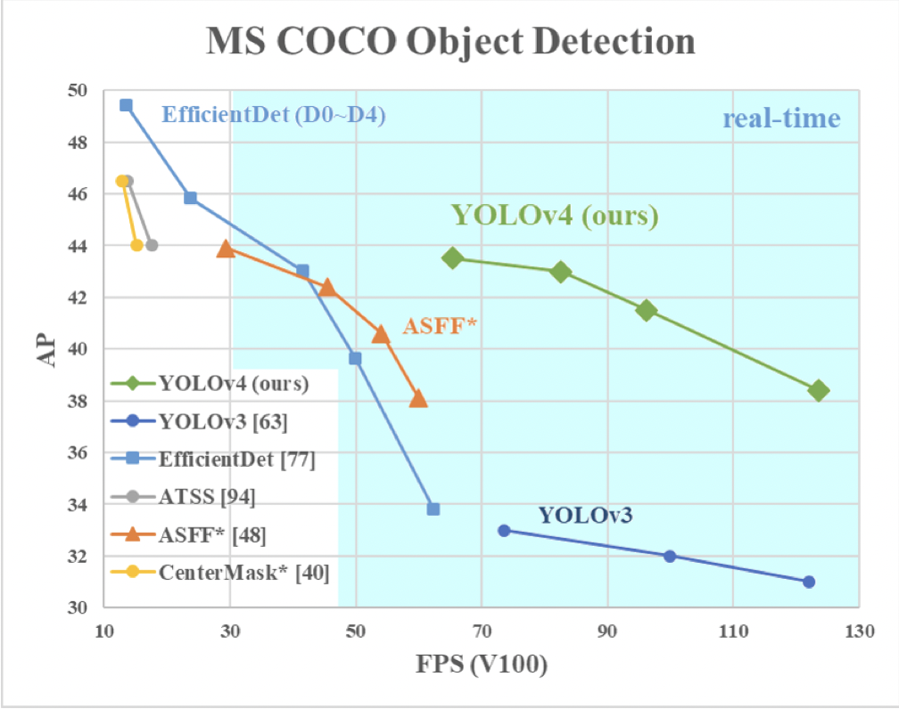
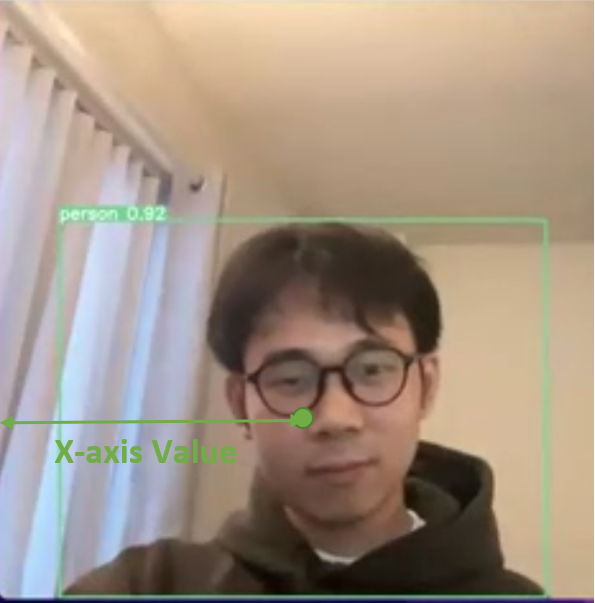
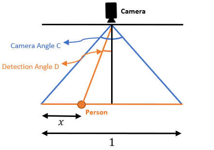
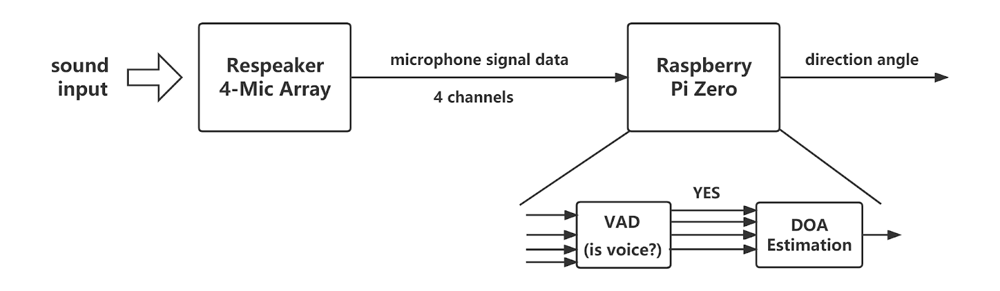
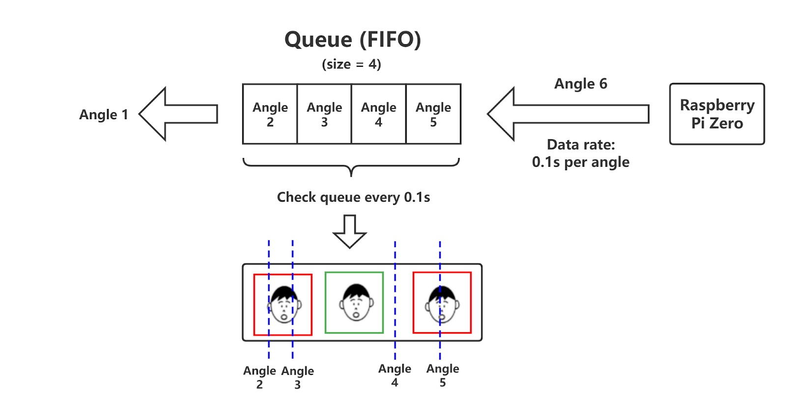
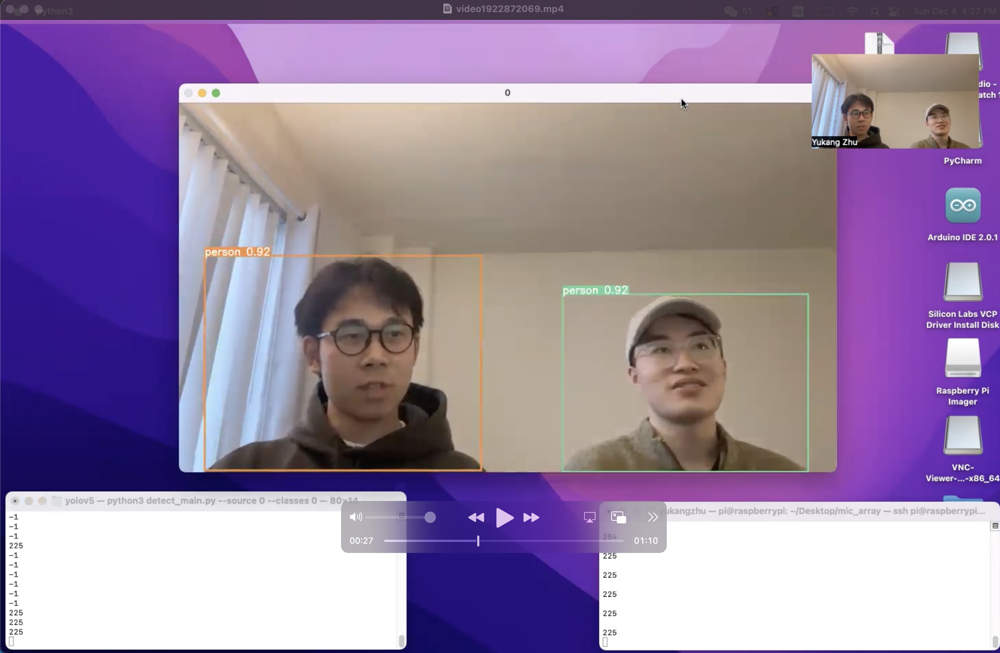
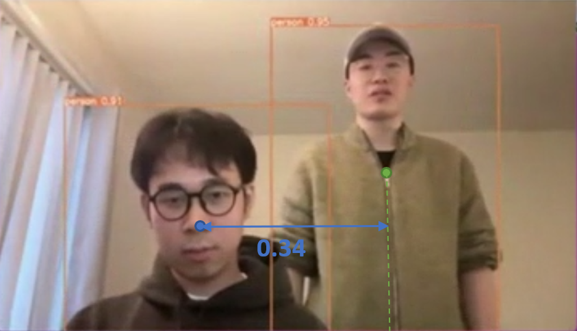

# Table of Contents
* Abstract
* [Introduction](#1-introduction)
* [Related Work](#2-related-work)
* [Technical Approach](#3-technical-approach)
* [Evaluation and Results](#4-evaluation-and-results)
* [Discussion and Conclusions](#5-discussion-and-conclusions)
* [References](#6-references)

# Abstract

This project aims to develop a vision and voice localization camera which can not only detect humans in a camera frame but also localize sound sources to track the person who is talking. In particular, we leverage YOLOv5 to conduct human detection and multiple algorithms like Voice Activity Detection (VAD) and Direction of Arrival (DoA) Estimation are utilized to realize sound source (voice) localization. The device was finally developed with a laptop, a Raspberry Pi Zero, and a Respeaker 4-Mic Array, in which the laptop serves as a central controller as well as the human detection part and the combination of Raspberry Pi and Respeaker is responsible for sound source localization. The evaluation results show that our vision and voice localization camera has good performance in accuracy and latency with respect to human detection and voice localization. The device also works well in multi-person and multi-sound-source scenarios.

# 1. Introduction

As an important sub-branch of speech recognition, audio-visual automatic speech recognition (A/V ASR) [1] [2] has been studied a lot recently to deal with the scenario where multiple people are simultaneously on the screen. In addition to the voice signal that is necessary for traditional speech recognition, A/V ASR takes great benefits from the addition of visual signal contained in a video where the speakers' faces show. To achieve high performance in speech recognition with a visual scene of more than one speaker, A/V ASR also requires solving the active speaker detection (ASD) problem, which means deciding which of the visible faces relates to the voice at each moment [3]. Traditional ASD requires short-term or long-term audio and visual information to accurately extract features of different speakers [4], which may require complex modeling and time-costing training to achieve satisfactory performance in a real-time scenario. 

To simplify this active speaker detection problem, Our project proposes to substitute ASD by changing the problem-solving time and stage: instead of conducting ASD to a completely recorded video, we can solve the "which person" dilemma at the very moment when the video is been recorded by a camera. In particular, by combining human detection and sound source localization (SSL) in real-time, we can achieve ASD in a camera frame without complicated audio-visual feature extraction. Specifically, we aim to develop a vision & voice localization camera to leverage the fusion of human detection and voice directioning in real-time, so that it is able to highlight the person that is giving voice, realizing a pre-stage active speaker detection.

The challenge of the vision & voice localization camera originates in two main technical approaches mentioned above: human detection and sound source localization. For human detection, we introduced the popular vision AI YOLOv5, which is a family of well-trained compound-scaled object detection models. For SSL, we leveraged a 4-microphone array module named Respeaker to realize the required algorithms. Another key assessment for our project is the performance in the multi-person scenario. Whether the device can give a continuously stable stream of active speaker detection results is the main concern of this project. Correspondingly, we also developed a queue-based SSL mechanism to deal with the deficiency of the SSL part of the device in the multi-sound-source scenario, which will be illustrated in detail in the technical approach section. Furthermore, aliasing and latency are also considered important metrics for the vision & voice localization camera. To correctly conduct active speaker detection, the SSL of the device should have a relatively low minimum angular separation to maintain good discernibility and avoid detection aliasing. All the assessment mentioned above has been performed sufficiently in our project, and the detailed results are shown in Evaluation and Results.

# 2. Related Work

The novelty of this project lies in the real-time integration of sound source localization (SSL) and human detection. To figure out the technical approach, related works on both sides are analyzed. 

There are a number of choices for the human detector. Modern detectors usually have two parts: backbone and head. In the human detection of this project, only the head part is taken into account. There are two types of head: one-stage object detector and two-stage object detector. The most popular two-stage detector is the R-CNN series, while two of the state-of-the-art one-stage detectors are YOLOv4 (You Only Look Once) and EfficientDet. The comparison of the performances of several modern detectors is shown in Figure 2.1, showing that YOLOv4 runs fastest under comparable performance [5]. Another comparison is made within YOLOv3, YOLOv4, and YOLOv5, showing that YOLOv5 provides the best performance [6]. In the scenario of this project, higher speed is preferred than higher accuracy, thus YOLOv5 is used.

    
     
    

      Figure 2.1 Comparison of YOLOv4 and Other State-of-the-art Object Detectors
  	

One of the popular methods for SSL is the time difference of arrival (TDOA) through generalized cross-correlation (GCC). In this method, the accurate time differences between microphones in a microphone array will be measured using GCC, and such differences will be used to calculate the angles between microphones and the object, thus the position of the object is gained [7]. An alternative method is using TDOA with analog circuits to filter out noise frequencies [8]. In this project, a well-designed product ReSpeaker is used which is capable of SSL through both TDOA and noise cancellation.

This project aims to highlight the person talking in a camera. There exists a product in the market called Meeting Owl 3 from Owl Labs that have a similar purpose. The product is placed in the middle of a meeting room, then it uses a 360° camera to record videos for everyone in the meeting room and zoom in on the people who are talking. The detailed algorithm and technical approach of this product are not released to the public; what is known is that it uses 8 Omni-directional beamforming Smart Mics for SSL and a differentiator for better performance [9]. Not knowing the algorithm but learning the idea from such a product, this project uses its unique SSL and human detection algorithm to make it work as expected. Other than the algorithm difference, this project uses an unchangeable camera view and highlights the humans using frames. 

# 3. Technical Approach

## A. Overview

Figure 3.1 shows the overview of the system structure of our device. The device has two kinds of inputs: vision input by the PC camera and sound input by the Respeaker module, which are respectively sampled for human detection and sound source localization. For the sound source localization part, the sound signal is first sampled by the 4-microphone array of the Respeaker module, then the microphone data is transmitted to Raspberry Pi Zero, where the data is analyzed and the direction of the sound is obtained and finally goes to the central controller (PC) through serial communication. On the other hand, the PC will also process the vision data collected by its camera and conduct human detection. Finally, the result of the fusion of human and voice localization will be presented by the PC in real-time.

    
     
    

      Figure 3.1 System Structure Overview
  	

Three main technical approaches utilized in our project will be illustrated in details in the following sections.

## B. Human Detection

Human detection is a key feature of this project. YOLOv5 is used for its high speed. Specifically, the model of YOLOv5s (small) is used as it has already provided enough accuracy. The color of the frame over each person in a camera is changed accordingly to represent the state of the person. If the person is not talking, the frame will be green; if the person is talking, the frame will be red. Other than that, the x-axis of each frame is exported from YOLOv5 for angle calculation as shown in Figure 3.2.

    
     
    

      Figure 3.2 YOLOv5 Human Detection and X-axis Value Output
  	

Angle calculation is needed because the output of the SSL is in angle. In order to compare the results of human detection with that of the SSL to decide the talking status, x-axis value needs to be converted to angle. The mathematical equation is calculated as shown in figure 3.3, where C refers to the camera's field of view and D refers to the human detection angle. In this project, C is measured to be 71.67°. The final equation is: D = arctan[(0.5-x)*tan(C/2)*2].

    
     
    

      Figure 3.3 YOLOv5 Angle Calculation Model
  	

## C. Sound Source (Voice) Localization
Sound Source (or Voice) Localization is another key technical approach in this project. To realize Voice Localization for our device, We utilized two algorithms which are Voice Activity Detection (VAD) and Direction of Arrival (DOA) Estimation. As shown in Figure 3.4, the microphone data sampled by the Respeaker is sent to Raspberry Pi in the form of 4 channels, these data will first be processed by VAD, which is basically used to classify whether the audio signal is human voice or not. Specifically, in our project, only when there are more than 2 channels recognized as voice can this data set of 4 channels be allowed to go to the next step, which is DoA estimation. Particularly, DoA in our project is simply implemented by calculating the difference of 4 channels' sound-source-target distance, which is mainly achieved by estimating the time offset difference of the signals from the 4 channels. Once we obtain the distance difference, the direction angle can be derived by simple geometry and mathematics.

    
     
    

      Figure 3.4 Voice Localization Framework of Our Device
  	

Practically, in our project, the VAD is implememted by python library webrtcvad and DoA is supported by the Respeaker with particular python libraries that can be run on Raspberry Pi Zero.

## D. A Queue-based Multi-sound-source Localization Method
Armed with Voice Localization by VAD and DoA, the combination of Respeaker and Raspberry Pi can easily detect the direction of single sound source with reasonable error and latency. However, when there are multiple sound sources in the camera frame at the same time, it becomes challenging for the module to stably output precise directions, since Respeaker and Raspberry Pi can only detect and generate one direction angle at a time. To solve this dilemma, we proposed a queue-based multi-sound-source localization method to help central controller correctly handle the direction angles coming from Raspberry Pi. Figure 3.5 presents the framework of the proposed method.

    
     
    

      Figure 3.5 Queue-based Multiple Sound Sources Localization Framework
  	

In our project, the data rate of the serial communicaiton between central controller and Raspberry Pi is 0.1 second per direction angle. The core concept of the queue-based multi-sound-source localization is to utilize a FIFO queue with a size of 4 to store the angles coming from the Raspberry Pi, and the angles in the queue are also checked every 0.1 second, considered as the directions that are now  giving voice. By doing so, we can allow at most 4 different voice sources simultaneously (in an ideal scenario), and also stabilize the detection. However, it's also obvious that this queue-based mechanism will cause a detection trailing, because every angle will at least stay in the queue for 0.4 second. 

# 4. Evaluation and Results
Figure 4.1 presents the final setup of the vision and voice localization camera for testing.

    
     
    

      Figure 4.1 Setup of the Device for Testing
  	

To evaluate the performance of this device, 3 kinds of tests are designed: conversations, multiple sound sources at the same time, and discernibility. Conversations are the most common scenario for the device in real life use. In our testing, we set two persons in the camera frame and let them talk freely with daily conversations. Figure 4.2 shows one screenshot of the testing, in which all persons in the camera are be detected by frames, and the person that is talking is highlited. Another testing is aimed to evaluate the multi-sound-source localization ability, in which we let two persons talking in the same time and assess the stability and accuracy of the detection. The last tesing is about the discernibility, that is, the minumum direction angle difference for two persons in the camera to have, in order to avoid aliasing or confusion of the human & voice localization.

    
     
    

      Figure 4.2 A Screenshot of One of the Tesing Scenarios  
  	

According to the testing results, our vision & voice localization camera shows overall good performance against the above 3 kinds of tests. In the conversation test, the device can detect the talking person with small latency and satisfactory accuracy. For the multiple sound sources test, the device worked well with a simultaneous two-person-talking scenario, and the display trailing caused by the queue-based method is tolerable. In the discernibility test, the minimum angular separation to avoid aliasing is 24.5°, which is efficient within a 71.67° camera we use. This threshold is shown in Figure 4.3. We also had a simple test for movement, and the device can operate normally for a person moving in a slow pattern.

    
     
    

      Figure 4.3 Discernibility Test: The Minumum Angle Seperation to Avoid Aliasing 
  	

It's relatively hard to measure and present sufficient quantified testing results for our real-time camera device, so for details, please check out the testing video uploaded to Youtube, find the link on the Home page, or just click [here](https://www.youtube.com/watch?v=_rtZ4ykac9A).

# 5. Discussion and Conclusions

As shown in the Evaluation and Results section, the performance of our device is good enough: the accuracies of recognizing, detecting, and localization are above expectation; the latencies and the trailing are tolerable. As a result, it is reasonable to conclude that this project works as expected.

However, there still exist some limitations and constraints in this project. Firstly, the ReSpeaker (4-Mic array version) is not capable of high-precision SSL; thus it limits the accuracy of the whole system. As a result, if high precision is needed, such as a large number of people in the same camera frame, a more accurate module is required. Secondly, since the detecting distance limit of the ReSpeaker is 3 meters, the performance of the device cannot be guaranteed if the system is applied in large spaces or open areas. 

There are possible improvements to this project as well. For instance, the system uses VAD to filter out unvoiced sound, but this function is not assessed statistically. Thus, this project would become more convincing if the denoising ability is well tested. Furthermore, the capability of detecting is not tested under the scenario in which people are moving fast. Other than that, some further steps can be taken based on this project. One example is to separate sound from the human voice and detect what object is making sounds. This might be done through VAD and YOLOv5 classifiers. All in all, this project has successfully completed the basic function of the vision and voice localization system and it works as expected; meanwhile,  improvements could be done for better performance. 

# 6. References
[1] O. Braga and O. Siohan, "A Closer Look at Audio-Visual Multi-Person Speech Recognition and Active Speaker Selection," ICASSP 2021 - 2021 IEEE International Conference on Acoustics, Speech and Signal Processing (ICASSP), 2021, pp. 6863-6867, doi: 10.1109/ICASSP39728.2021.9414160.

[2] T. Afouras, J. S. Chung, A. Senior, O. Vinyals and A. Zisserman, "Deep Audio-Visual Speech Recognition," in IEEE Transactions on Pattern Analysis and Machine Intelligence, vol. 44, no. 12, pp. 8717-8727, 1 Dec. 2022, doi: 10.1109/TPAMI.2018.2889052.

[3] O. Braga, T. Makino, O. Siohan and H. Liao, "End-to-End Multi-Person Audio/Visual Automatic Speech Recognition," ICASSP 2020 - 2020 IEEE International Conference on Acoustics, Speech and Signal Processing (ICASSP), 2020, pp. 6994-6998, doi: 10.1109/ICASSP40776.2020.9053974.

[4] Ruijie Tao, Zexu Pan, Rohan Kumar Das, Xinyuan Qian, Mike Zheng Shou, and Haizhou Li. 2021. Is Someone Speaking? Exploring Long-term Temporal Features for Audio-visual Active Speaker Detection. In Proceedings of the 29th ACM International Conference on Multimedia (MM '21). Association for Computing Machinery, New York, NY, USA, 3927–3935.

[5] Bochkovskiy, A., Wang, C., & Liao, H.M. (2020). YOLOv4: Optimal Speed and Accuracy of Object Detection. arXiv:2004.10934v1 [cs.CV]. 

[6] KIVRAK, O., & GÜRBÜZ, M. Z. (2022). Yolov3, Yolov4 ve Yolov5 Algoritmalarının Performans karşılaştırması: Kümes Hayvan tanıma i̇çin Bir Vaka çalışması. European Journal of Science and Technology. doi:10.31590/ejosat.1111288

[7] Chung, M., Chou, H., & Lin, C. (2022). Sound localization based on acoustic source using multiple microphone array in an indoor environment. Electronics, 11(6), 890. doi:10.3390/electronics11060890

[8] Tang H., Liao B., & You C. Sound-localizing camera. Retrieved December 10, 2022, from http://people.ece.cornell.edu/land/courses/ece4760/FinalProjects/f2014/ht425/Report/Report/ECE%204760%20Time%20System.html

[9] Owl 3 Data Sheet, Retrieved December 10, 2022, from https://resources.owllabs.com/hubfs/website/pdps/mo3%20datasheet/datasheet_mo3_en.pdf
